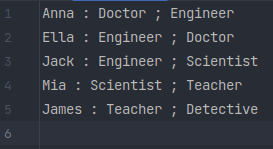
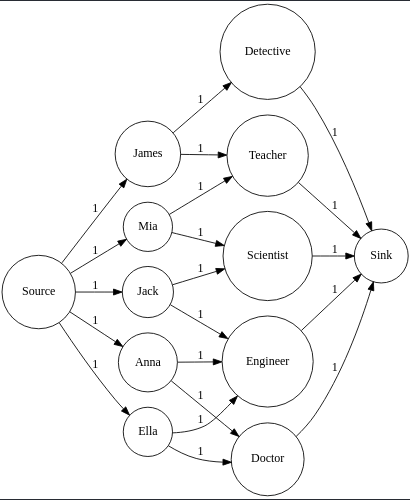
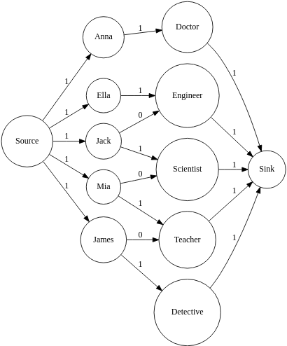
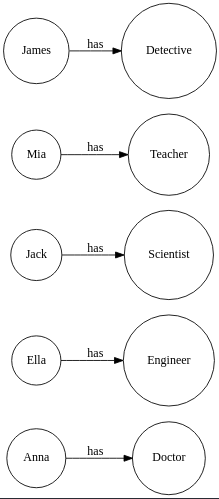

# OCaml Project

This project contains a model of [Maximum Bipartite Matching](https://en.wikipedia.org/wiki/Matching_(graph_theory)) problem, 
using an implementation of the [Ford-Fulkerson Algorithm](https://en.wikipedia.org/wiki/Ford%E2%80%93Fulkerson_algorithm).
Basically, you have a set of candidates, each of them having a list of wishes from a finite set, and you want to compute
a matching that satisfies the majority.

## How to run

To run the program, you have to follow these steps:

1. In the `wishes/` directory, you will find some `.txt` files, along with `.svg` files.
   The `.txt` files are the test cases, and the `.svg` files are their corresponding output. \
   To write your own test case, add a new `.txt` file and fill it with your data. \
   Considering a set 
   `C` of candidates <code>c<sub>i</sub></code> and a set `W` of wishes <code>w<sub>i</sub></code>, 
   each line of your data must follow this format:

   <pre>
   c<sub>i</sub> : w<sub>1</sub> ; w<sub>2</sub> ; ... ; w<sub>k</sub>
   </pre>

   A non correctly formatted file will make the program return an error. 
   Also, spaces around `:` and `;` characters are optional.

2. Open a terminal in the project root directory, and run this command :

   ```shell
   make run my_wish_file.txt # If your file name is 'my_wish_file.txt'
   ```
   
   It will generate a file name named `my_wish_file_result.svg`, containing a picture representation of the 
   computed result.
   
   You can also delete the existing output files to make the program regenerate them again.

## Checklist

### ✅ Minimal acceptable project

The Ford-Fulkerson algorithm have been implemented and is fully functional. See [algo.ml](src/algo.ml).

### ✅ Medium project

The algorithm is used to solve a Maximum Bipartite Matching problem, given input files (`.txt` files) located in the 
`wishes/` directory.

### ⏳ Better project

I have changed the problem to a **Min-Cost** Maximum Bipartite Matching.

For this purpose, I have added a second version of the Ford-Fulkerson algorithm, which now use a Bellman-Ford path 
finding algorithm. This ensures taking the path with minimum cost each time instead of any path.

The remaining part of my model is not present in this submitted version, but consisted in adding preference values to 
the wish file (using this syntax : <code>w<sub>i</sub> = p<sub>i</sub></code>), and using their opposite as weights of 
the graph (instead of the value 1). Meaning that the association <code>c<sub>i</sub> : w<sub>i</sub> = p<sub>i</sub> ; ...</code> 
will be represented by an arc from <code>p<sub>i</sub></code> to <code>w<sub>i</sub></code> with a label <code>-p<sub>i</sub></code>.

With this model, considering that in the wish file, the most preferred wish is the one with the highest preference value, 
the program would generate the matching that satisfies the majority AND satisfies the most each person.

## Algorithm steps

<table>
    <thead>
        <tr>
            <th>Step 1 (Input file)</th>
            <th>Step 2 (Parsing and translation)</th>
        </tr>
    </thead>
    <tbody align="center">
        <td>
            
        </td>
        <td>
            
        </td>
    </tbody>
    <thead>
        <tr>
            <th>Step 3 (Solving with Ford-Fulkerson)</th>
            <th>Step 4 (Result generation)</th>
        </tr>
    </thead>
    <tbody align="center">
        <td>
            
        </td>
        <td>
            
        </td>
    </tbody>
</table>

## Structure

In addition to the existing project files, I have added these files:

* <code>[wish_granter.ml](src/wish_granter.ml)</code> : it's the new entry point of the project 
  (I have configured `dune` to use it instead of the previous <code>[ftest.ml](src/ftest.ml)</code>).
* <code>[algo.ml](src/algo.ml)</code> : it contains two implementations of the Ford-Fulkerson Algorithm, 
  the first one named `ff` used for the medium project, and the second one named `ff2` used for the better project.
* <code>[wfile.ml](src/wfile.ml)</code> : it contains the wish file parser and the core functions used to solve the 
  matching problem.

## Author

Yacine BOUKARI \
[boukari@insa-toulouse.fr](mailto:boukari@insa-toulouse.fr) \
4A IR-SI Group A
